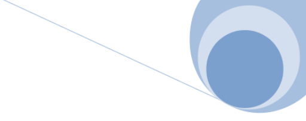

<!--A incluir al principio del proyecto-->

    

            

                <h2 style="color:#7ba0cd">Proyecto red social</h2>
            

            
        

    

        

            Entregas
        

    

  

**Documentación**

Se entregará una  documentación individual en formato markDown transformado a pdf con los siguientes apartados:

- Portada: Una portada representativa de vuestro proyecto. Debe incluir el Logo y el nombre de la red social. La portada puede ser compartida en el equipo.
- Contraportada: Nombre del alumno al que pertenece la documentación y grupo.
- Índice: Debe ser generado de manera automática.
- Organización del equipo: En este apartado debéis mostrar cómo habéis gestionado el equipo haciendo uso de la metodología scrum:
    - Backlog del sprint: El objetivo de este sprint es implementar la parte CSS y HTML del proyecto. Estamos simulando un sólo sprint. De los requisitos funcionales dados tendréis que extraer las tareas, ponderarlas, distribuirlas... Recordar que no sólo hay que distribuir tareas de desarrollo si no también de diseño o gestión. Podéis adjuntar varias capturas de pantalla del scrum board utilizado (recomendado trello) donde queda reflejada esta organización.
    -  Scrum diario: Durante las vacaciones deberías hacier una o dos sesiones de reunión. En teoría bastaría con una para organizar todo para que en la semana que tenéis disponible en el aula podáis sacar adelante vuestras tareas pero como no os conocéis igual no pueden ser tan rápidas. En una primera reunión sacaréis tas las historias de usuario y las asignaréis. En otra haréis lo que puramente se debe hacer en estas reuniones: ¿Qué hice ayer?, ¿Qué tengo planificado para hoy? y ¿Hay algún obstáculo?. Durante la semana que estéis en el aula trabajando en el proyecto, debéis hacer al menos una reunión y considerar las tres sesiones de aula como una jornada de trabajo (si hacéis más mejor). Para demostrar que esto se ha realizado tendréis que entregar una captura de pantalla de discord en la que se vea a todos los participantes.
    - Revisión del sprint: En una última reunión haréis una puesta en común de lo conseguido, de lo que no... Y una serie de conclusiones individuales.
- Páginas desarrolladas: En este apartado se pondrán unas capturas de las páginas desarrolladas y una explicación de las mismas haciendo hincapié en todo lo realizado.
- Valoración personal

**Ficheros html y css**

La página web se publicará en GitHub Pages. Se entregará el enlace al repositorio así como el enlace al sitio web publicado.

