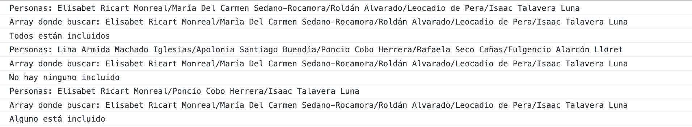
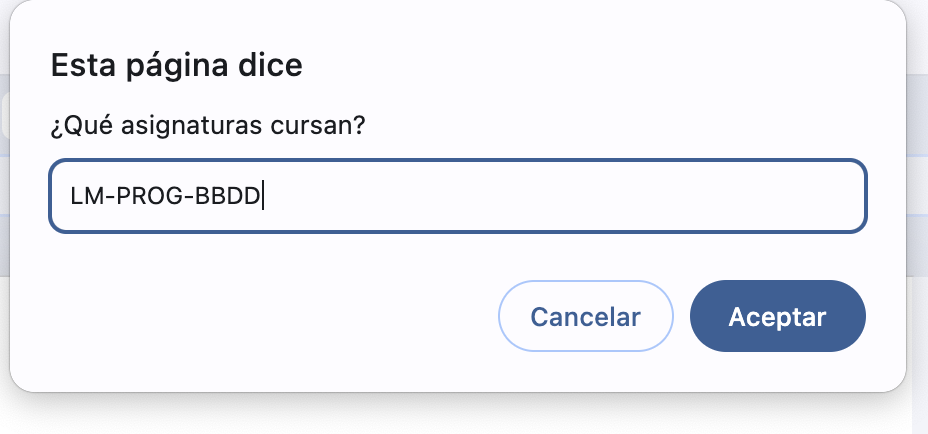
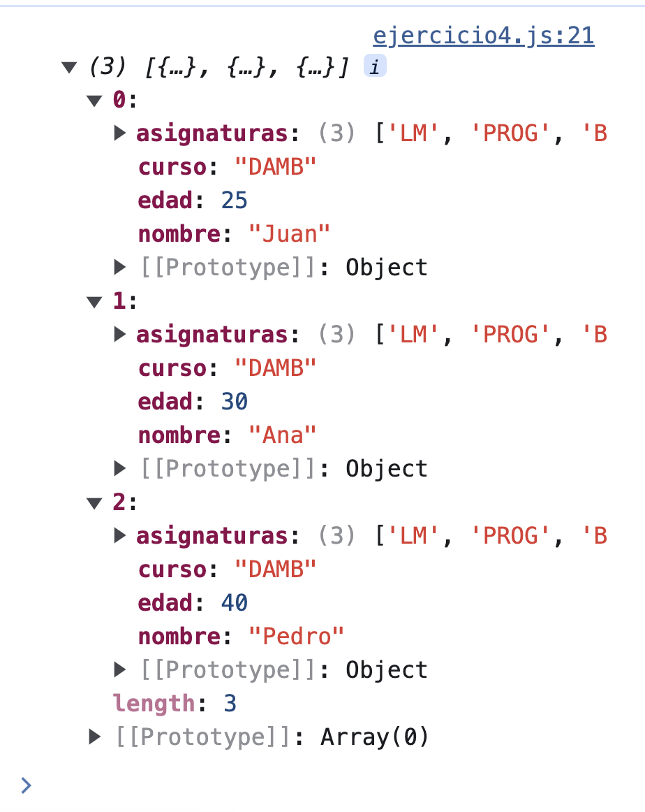

<!--A incluir al principio de la práctica-->
<div>
    <div style="display: flex; padding: 10pt; width: 100%; justify-content: flex-end;align-items: center">
            <div >
                <h2 style="color:#7ba0cd">JS-Fundamentos</h2>
            </div>
            
        </div>
    <div style="display: flex; background-color: #7ba0cd; justify-content: space-between; border-style: solid; border-width: thin;">
        <div style="text-align: center; color:white;font-weight:bold;width:100%">
            Normas generales para la práctica
        </div>
    </div>
  
</div>

<div style="font-size: 75%; border-style: solid; border-width: thin; padding: 3pt;">

**Condiciones de entrega**

* Se dispone de 3 sesiones para realizar la práctica. Se entregarán en la fecha indicada. No se admitirán ejercicios entregados  después de esa fecha.
* La entrega de todas las actividades se hará a través de GitHub y Aules. 
* En GitHub, al repositorio LM subirás un directorio que deberá nombrarse con el nombre y primer apellido del alumno seguido de la frase “-práctica1-UT5”. El nombre y los apellidos deben ir separados por un guión. En aules el enlace a ese directorio del repositorio.

**Condiciones de corrección**

* Las actividades se deben realizar con un editor (Visual Studio Code por ejemplo)
* Se deben entregar los ficheros .html y .js que se generen.
* Si se detecta copia en alguna actividad se suspenderá automáticamente la unidad de didáctica a todos los alumnos implicados.
* Si se detecta copia de alguna página web de internet u otro recurso, automáticamente se suspenderá la actividad copiada.

**Calificación**

* Existen tres actividades. Todas tienen la misma puntuación.
* Las actividades se puntuarán dentro del apartado de procedimientos que es un 10% de la nota de la unidad. 
  
</div>

<div style="padding: 3pt; font-weight: bold; background-color: gainsboro; margin: 5pt 0pt 5pt 0pt;">
Ejercicio 1. Funciones y parámetros
</div>
<div style="font-size: 75%; border-style: solid; border-width: thin; padding: 3pt;">

**Descripción**

* Crea una función que reciba una función de ordenación y un array. Si el tipo de algún parámetro no es el esperado debes imprimir un error (Acuérdate de cómo cambiar el color de la consola). Si es lo esperado, ordena el array de menor a mayor con la función de ordenación recibida. Retorna el array modificado en formato cadena. Tienes que implementar las siguientes llamadas:


**Ejemplos de llamadas**

```js

Ejercicio1()


let fechas = [
    "2023-06-15",
    "2021-12-10",
    "2022-03-25",
    "2023-01-01"
];
Ejercicio1(fechas,OrdenaFechas)


let numeros = [89, 23, 444, 150, 11];
Ejercicio1(numeros,OrdenaNumeros)

```
  
**Salida**

```js
El primer parámetro no es un array.
El segundo parámetro no es una función

Array original: [ '2023-06-15', '2021-12-10', '2022-03-25', '2023-01-01' ]
Array ordenado: [ '2021-12-10', '2022-03-25', '2023-01-01', '2023-06-15' ]

Array original: [ 89, 23, 444, 150, 11 ]
Array ordenado: [ 11, 23, 89, 150, 444 ]

```


</div>

<div style="padding: 3pt; font-weight: bold; background-color: gainsboro; margin: 5pt 0pt 5pt 0pt;">
    Ejercicio 2. Arrays
</div>
<div style="font-size: 75%; border-style: solid; border-width: thin; padding: 3pt;">

**Descripción**

* Crea una función llamada verAsignaturas. Esta función va a recibir un número indeterminado de alumnos. De cada alumno va a recibir un array. En ese array estará almacenado el nombre, el curso y las asignaturas de las que está matriculado (una asignatura en cada posición). Saca por pantalla el nombre del alumno – el curso – asignaturas:  y el nombre de las asignaturas separadas por un /. Si el número de datos de alumnos es 0 debes mostrar la cadena “No hay datos para mostrar”.Debes usar el operador rest, la desestructuración de arrays y  el código lo más compacto posible.

**Ejemplos de llamadas** 

```js
Ejercicio2(["Sara", "DAMA", "Programación", "ED"],["Martín", "DAMB", "Programación", "LM", "ED", "BBDD", "FOL", "SI"],["Emma", "ASIR","ISO","BBDD","LM"])
Ejercicio2(["Álvaro","Semi","BBDD"])
Ejercicio2()
```

**Salida**

. 

</div>

<div style="padding: 3pt; font-weight: bold; background-color: gainsboro; margin: 5pt 0pt 5pt 0pt;">
    Ejercicio 3. Arrays y funciones. Foreach
</div>
<div style="font-size: 75%; border-style: solid; border-width: thin; padding: 3pt;">

**Descripción**

* Crea dos arrays con nombres de [personas](https://fossbytes.com/tools/random-name-generator). Busca si los nombres del primer array están todos en el segundo, si no hay ninguno o si hay alguno. Usa foreach.¿Se te ocurre otra solución? 
   
**Ejemplos de llamadas** 

```js
/*Array original*/
Ejercicio4( ["Elisabet Ricart Monreal","María Del Carmen Sedano-Rocamora","Roldán Alvarado","Leocadio de Pera","Isaac Talavera Luna"], ["Elisabet Ricart Monreal","María Del Carmen Sedano-Rocamora","Roldán Alvarado","Leocadio de Pera","Isaac Talavera Luna"])
/*Ninguno incluído*/
Ejercicio4(["Lina Armida Machado Iglesias","Apolonia Santiago Buendía","Poncio Cobo Herrera","Rafaela Seco Cañas","Fulgencio Alarcón Lloret"
],["Elisabet Ricart Monreal","María Del Carmen Sedano-Rocamora","Roldán Alvarado","Leocadio de Pera","Isaac Talavera Luna"])
/*Alguno incluido*/
Ejercicio4(["Elisabet Ricart Monreal","Poncio Cobo Herrera","Isaac Talavera Luna"],["Elisabet Ricart Monreal","María Del Carmen Sedano-Rocamora","Roldán Alvarado","Leocadio de Pera","Isaac Talavera Luna"])
```

**Salida**



</div>

<div style="padding: 3pt; font-weight: bold; background-color: gainsboro; margin: 5pt 0pt 5pt 0pt;">
    Ejercicio 4. Arrays y funciones.Map
</div>
<div style="font-size: 75%; border-style: solid; border-width: thin; padding: 3pt;">

**Descripción**
Teniendo un array con el nombre y la edad de cada alumno, crea un array nuevo al que incorpores el curso y las asignaturas a las que esté matriculados (aunque no sea lo más óptimo, pregúntalas con prompt separadas por -). Utiliza map y pon la misma información a todos los items.


**Ejemplos de array** 
```js
let alumnos = [
    { nombre: 'Juan', edad: 25},
    { nombre: 'Ana', edad: 30},
    { nombre: 'Pedro', edad: 40}
  ]
  ```

**Salida**







</div>

<div style="padding: 3pt; font-weight: bold; background-color: gainsboro; margin: 5pt 0pt 5pt 0pt;">
    Ejercicio 5. Arrays y funciones.Map
</div>
<div style="font-size: 75%; border-style: solid; border-width: thin; padding: 3pt;">

**Descripción**

Filtra los usuarios que viven en Madrid y ordénalos por nombre, por último saca cada nombre convertido en mayúsculas.

const usuarios = [
  { nombre: "Ana", direccion: { pais: "España", ciudad: "Madrid", calle: "Gran Vía" } },
  { nombre: "Luis", direccion: { pais: "España", ciudad: "Barcelona", calle: "La Rambla" } },
  { nombre: "Carlos", direccion: { pais: "Francia", ciudad: "Paris", calle: "Champs-Élysées" } },
  { nombre: "María", direccion: { pais: "España", ciudad: "Madrid", calle: "Calle Arenal" } },
];
