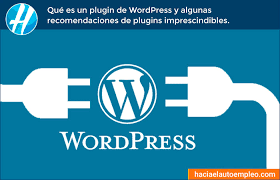

# Índice

[TOC]

# ¿Qué es la apariencia en WP?

Un tema de WordPress es un conjunto de archivos que constituyen la base de la apariencia del sitio, incluyendo diseños de página, hojas de estilo y posicionamiento de la barra lateral. Estos archivos determinarán la apariencia de las entradas y páginas de tu blog para los visitantes del sitio web. Hay más de 10.000 plantillas distintas accesibles en WP.

Cuando accedemos al menú apariencia, podemos ver que hay de los últimos tres años una plantilla oficial de WP, nombradas en inglés con el número de año. Desde este menú podremos cambiar el tema activo, eliminar o editar... 

También podemos escoger un tema desde la página oficial, filtrando por temática, maquetación...

# Personalizar un tema

Cuando presiono sobre la opción de personalizar, accedo a un menú donde tengo un montón de opciones específicas de ese tema en concreto. 

