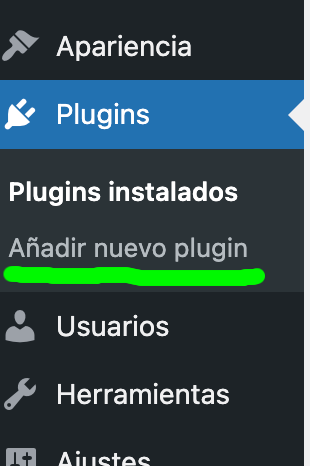
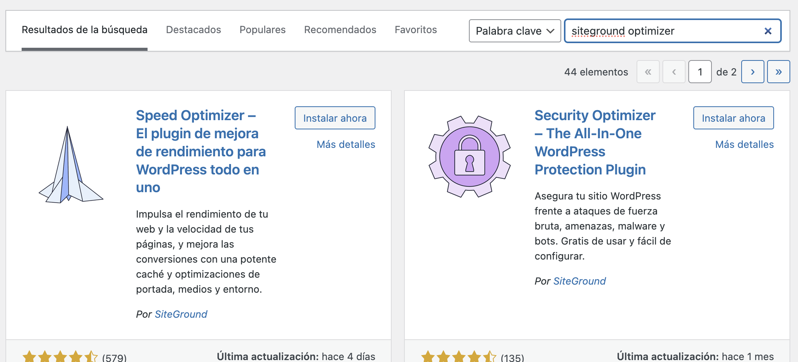

# Índice

[TOC]

# ¿Qué son los Plugings?

Un plugin de WordPress es un fragmento de código que se conecta a tu sitio web de WordPress. En pocas palabras, es una extensión a tu sitio que modifica y mejora las funciones principales de WordPress.
En lugar de editar los códigos originales de WordPress, usar plugins es una mejor solución para mejorar las capacidades de WordPress. Es más fácil descargar e instalar plugins que personalizar largos códigos. Tratar con el código es una tarea difícil después de todo.
Con los plugins, solo necesitas conectar códigos adicionales para modificar los originales. Y cuando los cambios ya no sean necesarios, puedes desconectarlos al desactivar el plugin.
Lo bueno es que existen miles de plugins disponibles para ti en WordPress. El uso correcto de los plugins no solo mejorará la funcionalidad y la experiencia del usuario de tu sitio web, sino que también mejorará tu flujo de trabajo.

Los plugins son los modificadores que convierten un blog común y corriente en un sitio web con cualquier forma y funcionalidad. Con unos simples pasos, los plugins pueden transformar tu sitio en una tienda virtual, una revista, un portfolio, un sistema de gestión de aprendizaje… ¡Todo lo que puedas imaginar!
Por ejemplo, si estás haciendo una tienda online, WooCommerce será tu nuevo mejor amigo. ¿Quieres hacer un sitio para un sistema de reservas? Dale un vistazo a Bookly.
¿Quizás eres un fotógrafo que quiere mostrar su trabajo en un sitio web? El plugin Envira Gallery es una opción perfecta.
Mientras que algunos plugins transforman totalmente tu sitio, otros actúan como simples ajustes detrás de escena. Es posible que no veas un cambio evidente, pero los plugins optimizan la forma en que funciona un sitio.
Por ejemplo, puedes agregar WPSmush para comprimir las imágenes. W3 Total Cache mejorará el rendimiento de tu sitio, y los plugins como WordFence aumentan la seguridad de tu sitio web.

# Buscar Plugings

Hay varios lugares donde puedes obtener los plugins de WordPress. Sin embargo, debes tener cuidado al elegir el lugar de donde los vas a descargar. Los plugins publicados por desarrolladores no confiables pueden dañar tu sitio web.

Desde el panel de administrador puedes acceder al repositorio de Plugings oficial.

En Wordpress.org también tenemos disponible el acceso al repositorio oficial de Plugings. El directorio de WordPress es el mejor lugar para buscar plugins. Hay más de 50,000 plugins publicados para que elijas

# Añadir un pluging

Podemos, desde la sección de administración de nuestro WP añadir un Pluging. Simplemente buscarmos a través del formulario el deseado y después le damos a Añadir.

Una vez añadidos, en la opción Plugings podemos ver un listado de todos los Plugings añadidos donde los podremos activar y manejar. 

