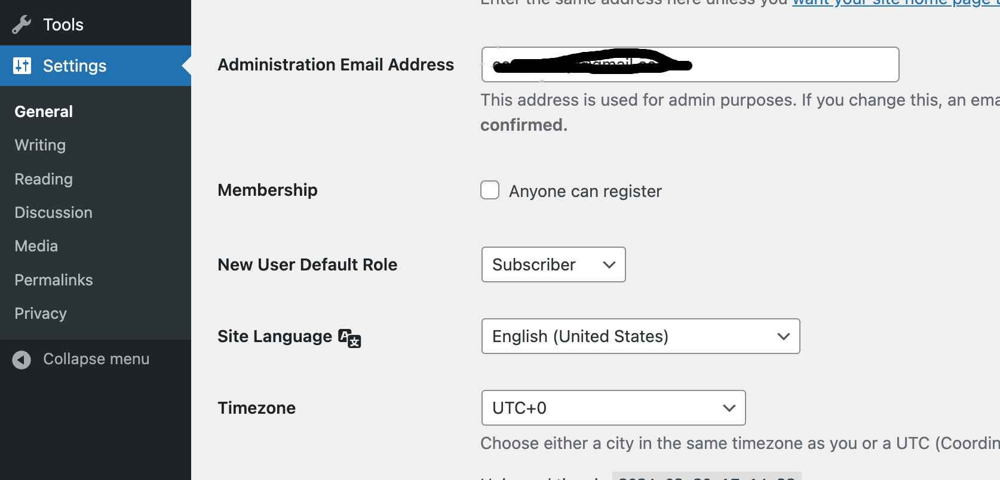
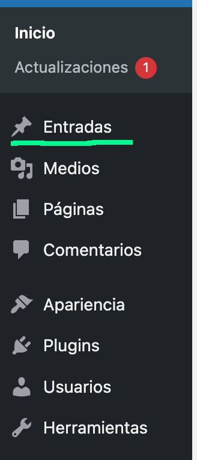
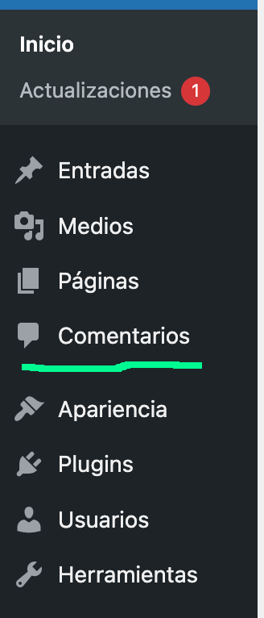

# Índice

[TOC]

# Configuración de idioma

El WP local por defecto aparece en inglés. A veces necesitáis cambiar el idioma y esto es posible. Podéis acceder a settings->site language-> *idioma*

# Páginas

Va a contener los archivos de nuestro sitio web. Por defecto nos vienen dos páginas: Sample web y Privacy Policy.

Para añadir una nueva página, presionamos sobre la opción "Añadir nueva"

Si observamos nuestro editor de páginas, lo primero que nos aparece es la posibilidad de escribir un título. Observa las características que aparecen en el formulario de la derecha:

Destacar que la visibilidad será pública para que sea accesible, que la podemos cambiar a estado de borrador hasta que la terminemos de editar y que podemos poner una imagen destacada que servirá para cuando compartamos la página (muy importante de cara al SEO, si no pones ninguna te coge la primera que encuentre)

Observemos las opciones que tenemos...

# Entradas

En WordPress, las “entradas” son un contenido fundamental utilizado habitualmente para un blog en un sitio web. Estas se utilizan para publicar contenido cronológico, como artículos, noticias, actualizaciones, publicaciones de blog y cualquier tipo de contenido que se organice por fechas, en modo inverso, con la entrada más reciente en la parte superior.

Para acceder a ella usamos el menú de WP-Admin

A diferencia de las Páginas en WordPress, que se utilizan para contenido estático y atemporal, las entradas están diseñadas para ser dinámicas y suelen estar complementadas con comentarios y además tener taxonomías de WordPress, que son las categorías y etiquetas.
Cada entrada de WordPress contiene varios elementos clave:

* Título: Se trata del título de la entrada, que generalmente describe el tema o el contenido principal de la misma.

* Contenido: Es el cuerpo o el contenido principal de la entrada, que puede contener texto, imágenes, videos y otros elementos multimedia.

* Fecha de Publicación: Cada entrada tiene una fecha de publicación que indica cuándo se publicó originalmente la entrada. Las entradas más recientes se muestran primero en la lista.

* Categorías y Etiquetas: Las entradas pueden ser categorizadas y etiquetadas para facilitar la organización y la búsqueda de contenido relacionado. Las categorías agrupan las entradas en secciones temáticas más amplias, mientras que las etiquetas son palabras clave específicas que ayudan a identificar temas o detalles específicos. Se denominan taxonomías.

* Comentarios: Las entradas suelen permitir, si se activan en Ajustes ➜ Comentarios, a los visitantes del sitio dejar comentarios, lo que permite la interacción y la participación en el contenido. Los comentarios pueden ser moderados por el administrador/a del sitio.
  
* Imagen destacada: Igual que en las páginas es necesario ponerla para que el motor de búsqueda no escoja la primera que encuentre.
* Extracto: Pequeña descripción de lo que va el post.

## Categorías

Nombre: Temática de nuestro log
Slug: Nombre de la URL
Descripción: Si queremos dar un poquito más de información.

## Etiquetas 

Poner en página las categorías y etiquetas y luego podemos filtrar. Luego con el slug se pueden filtrar las entradas...

# Comentarios
  
Siguiendo en el menú podemos acceder a los comentarios.

Los comentarios se pueden "moderar". Cuando accedemos a esta sección nos aparecen las opciones de *Rechazar* o *Mover a Spam*, en ambos casos el autor de los comentarios quedaría limitado en el uso de nuestro página web. Otras opciones son *Responder* que nos creará comentarios anidados o *Editar* por si hubiera alguna palabra malsonante o alguna falta de ortografía...

