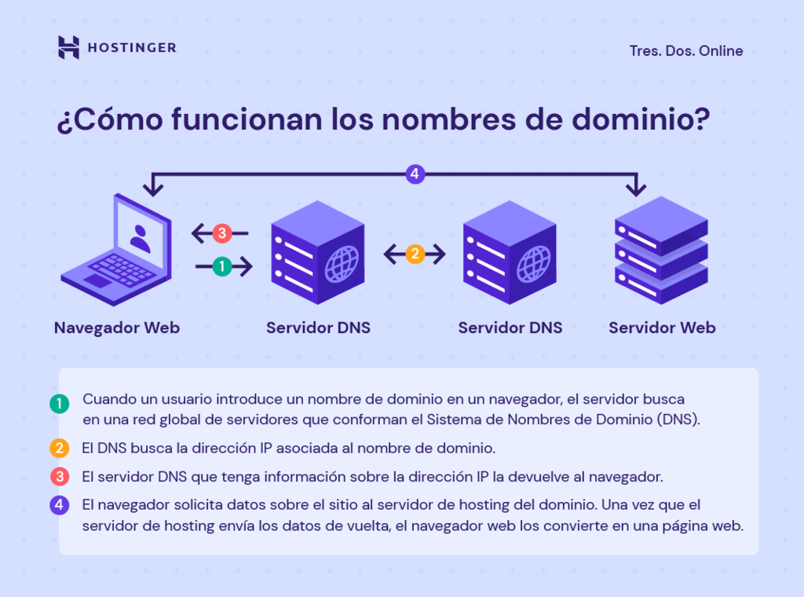

# Índice

[TOC]

# ¿Qué es WordPress? 

El término CMS proviene del inglés Content Management System, que significa Sistema de Gestión de Contenidos, un sistema online que nos permite poner en marcha un sitio web de forma práctica y rápida. Su gran ventaja es la posibilidad de administrar contenidos dinámicos de forma sencilla, es decir, mantener un blog, un ecommerce o cualquier otro tipo de página web que demande una actualización constante.

Imagínate por ejemplo que trabajas en un periódico o una revista. Tu audiencia siempre está buscando noticias de último momento y temas de actualidad, por lo que tú y tu equipo tenéis que producir contenidos nuevos constantemente. Este proceso de creación puede ser complejo: para cada nuevo contenido, es necesario crear la estructura técnica completa de la página y cada actualización manual lleva su tiempo. 

En tal escenario, ¿te imaginas lo caro y el coste temporal de este trabajo? Sería insostenible como negocio, en términos de tiempo y dinero.
Además, suponiendo que pudieras mantener el proyecto en marcha, la necesidad de contar con profesionales altamente capacitados y con los conocimientos técnicos necesarios también podría limitar en gran medida la aparición de nuevos negocios.
Para solucionar este tipo de problema estructural y operativo, se creó el CMS.

El CMS pues tiene tres funciones principales: Crear sitios web, gestionarlos y mantenerlos y darnos herramientas para poder administrarlos. Hoy en día existen muchos tipos diferentes de CMS en el mercado pero los más conocidos son:

* *WordPress*
* Drupal
* Joomla
* Wix
* Magento

Y entre tantas opciones, ¿Por qué WordPress? Principalmente por sus características:

* Facilidad de uso: presenta una interfaz amigable que no exige tener conocimientos técnicos elevados de la web.
* Personalización: existen numerosos diseños (más de 10.000 plantillas) y plugings que nos permiten configurar el sitio web tanto a nivel estético como de funcionalidad.
* Amplia comunidad que da soporte a nivel de recursos (información, soporte, dudas...). Además es código abierto.
* SEO: está diseñado teniendo en cuenta las recomendaciones para mejorar el posicionamiento de la web
* Actualizaciones y seguridad: el equipo técnico está en constante mejora de su seguridad.

> :hand: CONOCE un poco de la historia de Wordpress ==> [Vídeo](https://youtu.be/Zbor4XFOdKA)

# Wordpress.com y WordPress.org

Cuando se habla de WordPress tenemos que tener en cuenta que existen dos servicios diferentes. Vamos a ver la diferencia entre ambos:

- Wordpress.org
    - Código abierto, personalizable e ilimitado
    - Necesitamos un servidor para alojar nuestro sitio web

- Wordpress.com 
   - Empresa privada que ofrece el servicio permitiendo al usuario despreocuparse de cuestiones técnicas.
    - Poco personalizable y limitado
    - Ofrece hosting y dominio.

 > :hand: NAVEGA por WordPress.com y por Wordpress.org para ver las diferencias ==> [Vídeo](https://youtu.be/Zbor4XFOdKA)

# Conceptos básicos

Algunos conceptos básicos que tenemos que tener en cuenta antes de utilizar WordPress:

- **Dominio**: Un nombre de dominio es una dirección web. Aunque un nombre de dominio y una URL (Localizador Universal de Recursos) comparten algunas similitudes, se refieren a cosas diferentes. Una URL es una dirección completa del sitio web que puede dirigir a los usuarios a una página específica de un sitio. Un nombre de dominio es sólo una parte. Una URL se compone de un protocolo, un dominio y una ruta. 
  
- **Servidor DNS**: cada dominio está vinculado a una dirección IP. Cuando un usuario introduce un nombre de dominio en un navegador, el servidor buscará a través de una red global de servidores que conforman el Sistema de Nombres de Dominio (DNS). Los servidores DNS buscarán la dirección IP asociada al nombre de dominio. El servidor que tenga información sobre la dirección IP la devolverá al navegador web. Luego, solicitará datos sobre el sitio al servidor de hosting del dominio.
El servidor web almacena todos los datos de la web, incluidos sus archivos, la base de datos y el código HTML. Una vez que el servidor de alojamiento devuelve los datos, el navegador web los convierte en una página web que los usuarios pueden visitar.

- **Hosting**: Un hosting es un servicio online que hace que se pueda acceder a tu sitio web en Internet. Al contratar un hosting web, estás alquilando un espacio en un servidor que almacena todos los archivos y datos de tu sitio web para que funcione correctamente.
Los proveedores de hosting web proporcionan la tecnología y los recursos necesarios para que tu sitio web funcione de forma eficaz y segura. Éstos se encargan de mantener el servidor en funcionamiento, aplicar medidas de seguridad y garantizar que datos como textos, fotos y otros archivos se transfieran correctamente a los navegadores de los visitantes. Existen diferentes tipos de hosting:
  - Hosting compartido: varios usuarios comparten los mismos recursos del servidor.
  - Hosting VPS: compartes recursos pero el proveedor crea una partición virtual para cada usuario.
  - Cloud hosting: utiliza servidores virtuales para para alojar sitios.
  - Hosting Dedicado: Por ejemplo, hosting wordpress con un entorno optimizado para páginas que usan esta CMS. 

# Primeros pasos en Wordpress

En clase vamos a trabajar con WordPress.org de manera local. Para ello nos instalaremos un servidor local (XAMPP -- PDF Wp-XAMPP para más info) y dentro crearemos nuestro sitio web con WP. 

1. Descargaremos WordPress de la página oficial https://es.wordpress.org/. Cogeremos la última versión LTS. 
2. Descomprimir el fichero bajado en la carpeta htdocs que se encuentra dentro de tu XAMPP.
3. Renombramos la carpeta a PruebaWP.
4. Arrancamos el servidor XAMPP.
5. Para usar WP, cada vez que creemos un sitio nuevo, tenemos que crear la BBDD. Nos vamos al administrador de MYSQL y creamos una nueva BBDD de nombre PruebaWP y codificación UTF8mb4_general_ci.
6. Accedemos a la URL localhost/nombreSitio. Durante la instalación nos va a pedir dos tipos de datos:
   1. Datos de acceso a la BBDD: 
      1. Nombre de la BBDD: pues si antes le hemos puesto PruebaWP ese será.
      2. Usuario: como no hemos creado ninguno usaremos root.
      3. Contraseña: root no tiene contraseña.
   2. Datos de administación de WP:
      1. Título del sitio: Por ejemplo Mi primer sitio WP.
      2. Nombre usuario: Usuario para administrar WP, por ejemplo, admin.
      3. Contraseña: Para no olvidarnos vamos a poner admin_prueba.
      4. Completar resto de campos
7. Probar Backend/Frontend. 

## Administración del sitio

  

# Biografía

https://www.youtube.com/watch?v=lwNEskjrGD8
