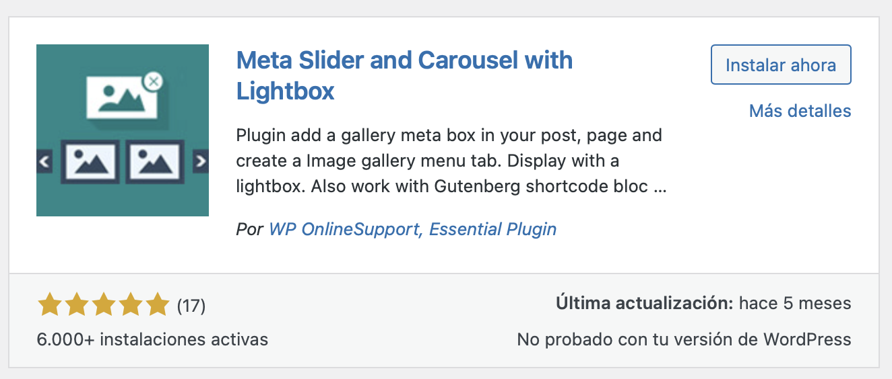
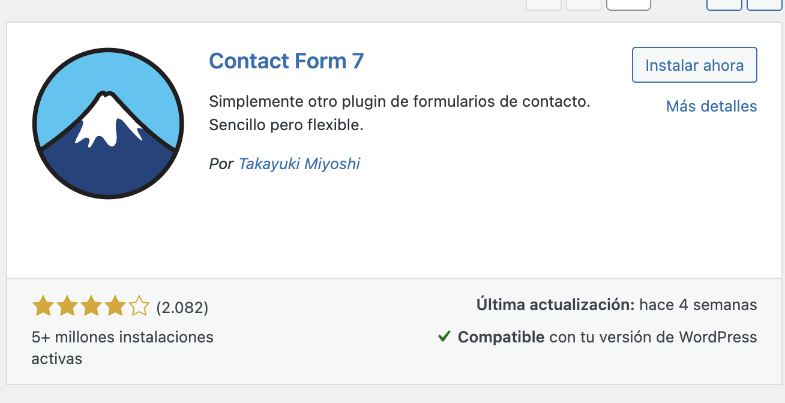

<!--A incluir al principio de la práctica-->

    

            

                <h2 style="color:#7ba0cd">WP - Personalizando plantillas</h2>
            

            
        

    

        

            Normas generales para la práctica
        

    

  

**Condiciones de entrega**

* Se dispone de 2 sesiones para realizar la práctica. Se entregarán en la fecha indicada. No se admitirán ejercicios entregados  después de esa fecha.
* La entrega de todas las actividades se hará a través de GitHub y Aules. 
* En GitHub, al repositorio LM subirás un directorio que deberá nombrarse con el nombre y primer apellido del alumno seguido de la frase “-práctica1-UT5”. El nombre y los apellidos deben ir separados por un guión. En aules el enlace a ese directorio del repositorio.

**Condiciones de corrección**

* Las actividades se deben con las herramientas trabajadas en el aula
* Se deben entregar el directorio centro generado
* Si se detecta copia en alguna actividad se suspenderá automáticamente la unidad de didáctica a todos los alumnos implicados.
* Si se detecta copia de alguna página web de internet u otro recurso, automáticamente se suspenderá la actividad copiada.

**Calificación**

* Existe una actividad que se evaluará entre 0 y 10.
* Las actividades se puntuarán dentro del apartado de procedimientos que es un 10% de la nota de la unidad. 
  

Personalizar plantilla - Página de inicio

**Descripción**

En esta nueva práctica vamos a personalizar la "Galería de imágenes" y los "Contactos".

Como WordPress tiene una galería de imágenes muy básica, vamos a instalar un Plugin. Dirígete a Plugins -> Añadir nuevo. Busca un plugin llamado "meta slider". Selecciona "Meta Slider and Carrousel with ligthbox"

Instálalo y actívalo. Configúralo en la nueva sección del menú, ¡Es muy intuitivo!

Una vez configurada, dirígite a Meta Galery y selecciona el shortcode generado. Creamos una página "Galería" y pegamos el shortCode. Añade esta página al menú.

Vamos a crear una página contactos y en él vamos a añadir un plugin de contactos. Busca contacts e instala el plugin Contact Form 7. 

Configúralo poniendo nombre, teléfono, email y comentarios. Añádelo a tu página de contactos.

Instala tú otro plugin y añádelo al menú.

