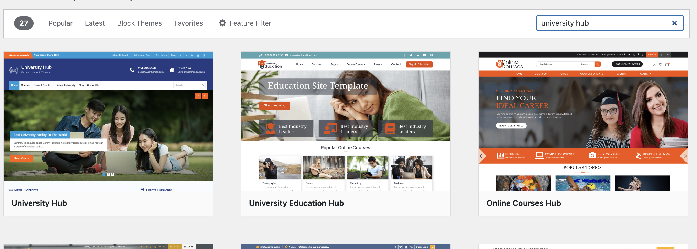

# Índice

[TOC]

# Despliegue

En este proyecto comenzaremos desde 0. 

1. Instalar un servidor web con determinados servicios. 

En nuestro caso usaremos xampp. 

2. Arrancar Apache y MySQLDatabase

3. Descargar WP. Acuérdate que iremos a [wordpress.org](https://wordpress.org/download/)
4. En el directorio de xampp/htdocs vamos a alojar el comprimido descargado.
5. Creamos un nuevo directorio llamado centro. Descomprime la carpeta de wp dentro de este directorio.
6. Acceder con un navegador a localhost y accedemos a PHPMyAdmin.
7. Creamos una BBDD que llamaremos centroBD con codificación utf8_spanishbbdd.

8. Accedemos al instalador. Para ello desde un navegador pondremos la url localhost/centro

9. Configuramos el acceso a la bbdd

10. Completamos el siguiente formulario

# Plantillas

Vamos a seleccionar una plantilla dentro del repositorio de WordPress. 

1. Vamos a Apariencia-> Temas y presionamos sobre añadir tema.
2. Buscamos tema "university hub"

3. Activamos el tema
4. Dirígete al sitio para ver que todo ha sido correcto localhost/centro

5. Editando el perfil puedo quitar la barra de administación del sitio

# Personalizar el sitio

1. Entramos al modo administrador de nuestro WorPress (acuérdate localhost/nombre-sitio/wp-admin)
2. Accedemos a la plantilla y le damos a personalizar para cambiar aspectos de la plantilla.
   

   