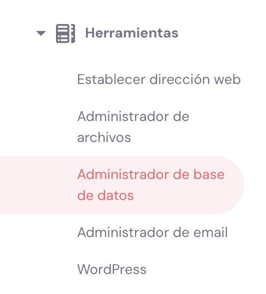

<!--A incluir al principio de la práctica-->

    

            

                <h2 style="color:#7ba0cd">Publicación de mi WP</h2>
            

            
        

  

## Guión

1. Vídeo explicativo WP
2. Publicar práctica de hosting gratuito: 000webhost - Crear tu hosting.
3. Instala WP entrando al panel de control -> herramientas -> WP

4. Accede a tu sitio web

5. Accede al admin de wp

## RECURSOS

4. Crear un dominio gratuito: https://www.freenom.com/es/index.html?lang=es 
5. ¿Hostinger, 000webhost...? => https://www.hostinger.es/tutoriales/preguntas-frecuentes-de-hostinger#:~:text=Hostinger%20es%20una%20empresa%20matriz,marca%20para%20el%20mercado%20indonesio.